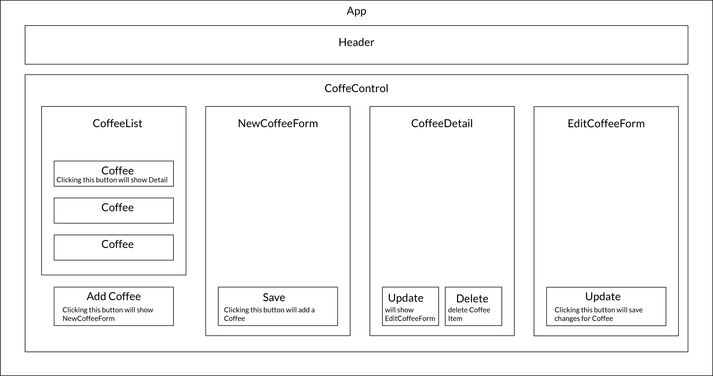

# Coffee Shop Inventory

#### By Moshe Atia Poston

## Description

This React application manages a coffee inventory. Users can add new burlap sacks of coffee, view details of each coffee type, edit coffee details, and sell coffee by the pound. Each sack of coffee displays its name, origin, roast type, weight, and price.

## Technologies Used

- React
- JavaScript
- HTML
- CSS
- Webpack

## Component Diagram

## Component List

- App.js
- Coffee.js
- CoffeeControl.js
- CoffeeDetail.js
- CoffeeList.js
- EditCoffeeForm.js
- Header.css
- Header.js
- NewCoffeeForm.js
- ReusableForm.js

## Setup/Installation Requirements

1. Clone the repository to your local machine.
2. Navigate to the project directory.
3. Install dependencies with `npm install`.
4. Start the application using `npm run start`. Normally, your browser will automatically open the app.
5. If it doesn't - visit `http://localhost:3000` in your browser to view the app.

## Known Bugs

- At this moment the user cannot 'sell' coffee.

## License

[MIT](https://choosealicense.com/licenses/mit/)

Copyright (c) 2023 Moshe Atia

Permission is hereby granted, free of charge, to any person obtaining a copy of this software and associated documentation files (the "Software"), to deal in the Software without restriction, including without limitation the rights to use, copy, modify, merge, publish, distribute, sublicense, and/or sell copies of the Software, and to permit persons to whom the Software is furnished to do so, subject to the following conditions:

The above copyright notice and this permission notice shall be included in all copies or substantial portions of the Software.

THE SOFTWARE IS PROVIDED "AS IS", WITHOUT WARRANTY OF ANY KIND, EXPRESS OR IMPLIED, INCLUDING BUT NOT LIMITED TO THE WARRANTIES OF MERCHANTABILITY, FITNESS FOR A PARTICULAR PURPOSE AND NONINFRINGEMENT. IN NO EVENT SHALL THE AUTHORS OR COPYRIGHT HOLDERS BE LIABLE FOR ANY CLAIM, DAMAGES OR OTHER LIABILITY, WHETHER IN AN ACTION OF CONTRACT, TORT OR OTHERWISE, ARISING FROM, OUT OF OR IN CONNECTION WITH THE SOFTWARE OR THE USE OR OTHER DEALINGS IN THE SOFTWARE.

- If you detect any bug in the program, please reach out to me at [moshikoatia@gmail.com](mailto:moshikoatia@gmail.com).
